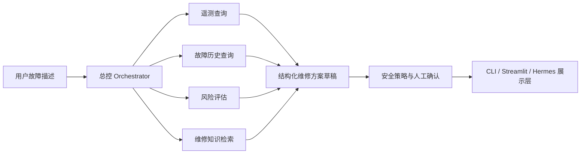

# 多工具调用工业运维Agent：设备故障查询+维修方案自动生成

一个可运行、可评测、有安全边界的工业运维 Agent 教学项目。题目保持不变，第一版以工业离心泵为演示对象，通过多个只读工具查询设备状态、故障历史、风险规则和维修知识，生成带来源、待人工确认的维修方案草稿。

## 项目亮点

- 不是单次提示词问答：总控明确协调 4 个工具并展示调用轨迹。
- 不是无来源生成：每条维修知识保留资料名称、网址和页码。
- 不是模型黑盒：确定性核心可离线运行，Hermes Agent 是可选适配层。
- 不是伪造工业落地：仿真数据、用户导入快照、公开数据和维修资料边界明确标注。
- 不是只展示效果：固定 30 个检索案例，29 项自动化测试（含网页交互）。
- 不越权：只读查询和草稿生成可自动完成，真实设备控制不在范围内。
- 可追溯：统一工具状态契约、本地 SQLite 会话审计、人工反馈和失败降级。

## 架构



## 快速开始

项目不强制安装新依赖，命令行核心只使用 Python 3.11 标准库。

```powershell
cd "C:\Users\Administrator\Documents\industrial-maintenance-agent"
$env:PYTHONPATH = "src"

# 诊断演示
python -m industrial_maintenance_agent.cli diagnose `
  --equipment-id PUMP-001 `
  --symptom "泵振动明显，出口压力下降"

# 30 案例评测
python -m industrial_maintenance_agent.cli evaluate

# 本地影子试点评测摘要
python -m industrial_maintenance_agent.cli shadow-report --limit 100

# 校验脱敏的只读遥测快照
python -m industrial_maintenance_agent.cli validate-telemetry-csv `
  --file data/sample/telemetry_snapshot.csv

# 使用只读 CSV 诊断（不会写回设备）
python -m industrial_maintenance_agent.cli diagnose `
  --telemetry-csv data/sample/telemetry_snapshot.csv `
  --equipment-id CSV-PUMP-001 `
  --symptom "振动升高"

# 自动化测试
python -m unittest discover -s tests -v

# 网页
streamlit run app.py --server.port 8502
```

网页地址：`http://127.0.0.1:8502`

网页左侧可在“项目仿真数据”和“上传只读 CSV”之间切换。CSV 必须使用 UTF-8，模板位于 `data/sample/telemetry_snapshot.csv`。导入只发生在当前进程内，不保存上传文件、不连接设备，也不提供写回能力。

## 公开数据

项目已实际下载并校验 UCI AI4I 2020：

- 10,000 条设备记录
- 339 条机器故障，故障率 3.39%
- TWF/HDF/PWF/OSF/RNF 五类故障标记
- CC BY 4.0
- 本地 CSV SHA-256：`dc6630cd9b1f0f853922fad78a1b6436570d3f1ec863f1dd5c4340ac56bc8a8e`

原始数据不提交到 Git；来源、许可证、摘要和哈希保存在 `data/manifests/ai4i.json`。重新下载：

```powershell
python scripts\download_ai4i.py
```

诊断完成后会返回 `session_id` 并写入本地审计库（`data/runtime/` 已忽略提交）：

```powershell
python -m industrial_maintenance_agent.cli sessions --limit 10
python -m industrial_maintenance_agent.cli session --session-id "完整会话编号"
python -m industrial_maintenance_agent.cli feedback --session-id "完整会话编号" --rating partial --comment "需要补充趋势"
python -m industrial_maintenance_agent.cli shadow-report --limit 100
```

## Hermes Agent

项目提供两种集成方式：

1. `adapters/hermes.py`：通过官方 `AIAgent` Python 接口，把已经验证的 JSON 方案整理为自然语言。Hermes 不参与安全裁决。
2. `hermes_skill/industrial-maintenance/SKILL.md`：可安装到 Hermes 的项目技能，让 Hermes 通过终端调用本项目 CLI。

Hermes 是可选依赖，需要单独安装并配置模型密钥；未安装时所有核心功能和网页仍然可用。

## 评测结果

| 指标 | 结果 | 解释 |
|---|---:|---|
| 固定案例 | 30 | 6类故障现象，每类5种表达 |
| Top-1 命中率 | 100% | 只代表当前固定回归集 |
| 无匹配误生成测试 | 通过 | 无可靠知识时不生成维修动作 |
| 自动化测试 | 29/29 | 领域、仓储、CSV 校验、工具契约、降级、冲突、审计、反馈、影子评测、安全、网页和 Hermes 适配 |

100% 不是工业诊断准确率。评测集由公开维修知识的同义表达整理，作用是防止后续修改破坏已知能力。

## 目录

```text
industrial-maintenance-agent/
├── app.py                    # Streamlit 演示
├── data/
│   ├── evaluation/           # 30个固定评测案例
│   ├── knowledge/            # 结构化维修知识
│   ├── manifests/            # 公开数据来源、许可和哈希
│   └── sample/               # 明确标注的仿真设备
├── docs/                     # 架构、数据、评测、状态和路线图
├── hermes_skill/             # Hermes 技能包
├── scripts/                  # 数据下载脚本
├── src/industrial_maintenance_agent/
│   ├── adapters/             # Hermes 可选适配器
│   ├── agents/               # 多工具总控
│   ├── data_import/          # 公开数据校验
│   ├── domain/               # 结构化输入输出
│   ├── evaluation/           # 评测引擎
│   ├── repositories/         # 数据访问
│   ├── safety/               # 安全策略
│   └── tools/                # 单一职责工具
└── tests/
```

## 重要边界

该项目是公开数据教学原型，不控制真实设备，不替代具体型号手册和合格维修人员。维修动作必须人工核对，危险场景必须升级处理。
